# Claude Usage Widget

A privacy-first macOS menu-bar app for people who run **many AI subscription accounts** — Claude (Claude Code / claude.ai), OpenAI Codex, and xAI Grok — and need to know, at a glance, which account each CLI is using, how much headroom it has, and which one to switch to next. It switches the CLIs between accounts for you before a limit stalls a running session, and keeps a local ledger of what every account actually consumed.

Built as a stripped-down, heavily extended fork of [Claude Usage Tracker](https://github.com/hamed-elfayome/Claude-Usage-Tracker) (MIT), with all external telemetry removed.

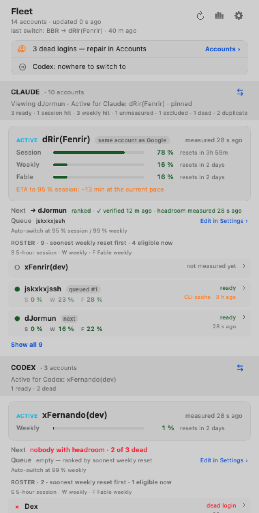

## What you see

### The menu bar

Three layouts, chosen in **Settings › Display**:

| Layout | What it shows |
| --- | --- |
| **Every account** | One tile per account, grouped by provider (Codex, Grok, Claude), each tile with its session and weekly bars. The original layout. |
| **Active + dots** | Per provider: the active account's tile plus one small dot per other account. The block is as wide as its account count needs. |
| **Active + counts** | Per provider: the active account's tile plus readiness counts (ready / exhausted / dead / suspected). |

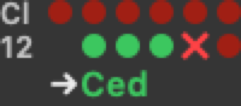 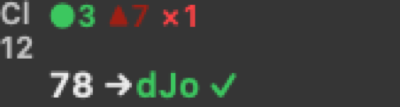

In the dot layouts the dots are **ordered by time to the weekly reset**: the rightmost dot resets soonest, the leftmost is farthest away, and accounts with no known reset (dead, never measured) sit together at the far left. Every provider block keeps its designed order on the bar (Codex, Grok, Claude), followed by the **⇄ item**.

### Colours — one meaning everywhere

The same colour means the same thing on a dot, a roster row, a dashboard chip. Bright always means *more relief available*; faded means less.

| Dot | Meaning |
| --- | --- |
| Bright green | Session available; weekly **and** Fable windows both have more than 50 % left |
| Light green | Session available; weekly or Fable under 50 % left |
| Bright orange | 5-hour session limit hit; weekly and Fable both over 50 % left |
| Faded orange | 5-hour session limit hit; weekly or Fable under 50 % left |
| Bright red | Weekly or Fable limit hit, and the reset is **within 24 hours** |
| Faded red | Weekly or Fable limit hit, reset more than a day away |
| Purple ◆ | Suspected rate-limited (inferred from repeated refusals, not confirmed) |
| Hollow ○ | Never measured |
| × | The account itself is broken — dead or revoked login |
| − | Excluded from the fleet (free plan, or opted out) |

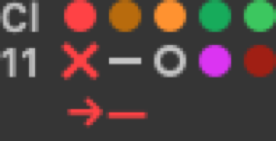

"Hit" means a server-affirmed reading at or over the auto-switch threshold; an inferred throttle is never painted red. The full legend — every glyph, badge, tile element, menu row — is in [`docs/specs/menubar-legend.html`](docs/specs/menubar-legend.html) (open it locally; it embeds real-size frames).

### The ⇄ item: who is active for what

Click ⇄ for one section per provider: the account each CLI is logged into, its live numbers, the ranked next candidate with its preflight verdict, and the actions — switch, queue, repair a dead login, use a Codex usage-limit reset.

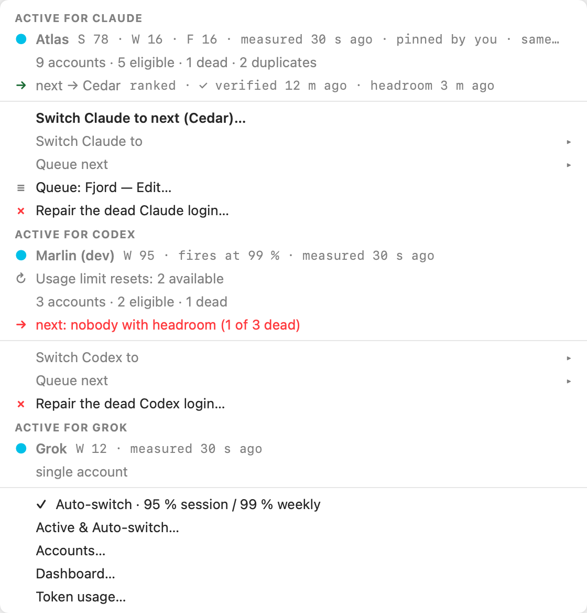

Two notions are kept apart everywhere in the app:

- **Viewing** — the account whose numbers and logins Settings shows you. Changing it never touches a CLI.
- **Active for Claude / Codex / Grok** — the account each CLI is actually using. Only an explicit switch (or auto-switch) changes it.

### The dashboard

Clicking a provider block (in **Active + dots** / **Active + counts**) opens the fleet dashboard: every account grouped by provider with session / weekly / Fable bars, reset countdowns, provenance and age of each number, the auto-switch queue with the next candidate's preflight verdict, and dead-login calls to action. Under each provider the roster comes in three bands: **next up** (the accounts the auto-switch would take, in its own order), **capacity returns** (exhausted accounts, soonest return first, muted) and **not switchable** (dead, excluded, duplicates) — and every row says when its weekly window resets (`W resets in 1d 4h`; `F …` when the Fable weekly is the exhausted window; `~` marks a boundary projected from the previous week rather than reported; `reset unknown` when the API never reported one), the absolute time on hover. The **Insights** block at the end shows the reset timeline for the next seven days, blind spots, changes made outside the app, the switch log, burn rates, rate-limit incidents of the last 24 hours, and remaining capacity per provider.

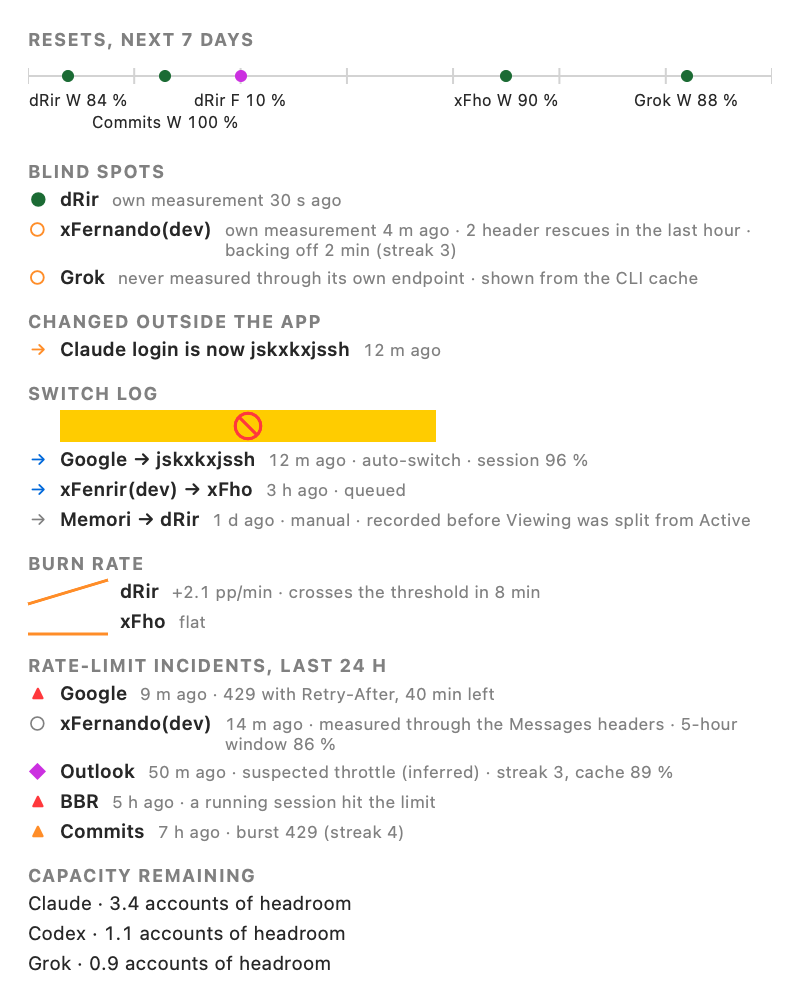

### Settings

Six pages: **Accounts** (the roster and an inspector per account: Overview, Login, Alerts, Monitoring), **Active & Auto-switch** (per-provider cards, policy, hand-off queue, eligibility), **Alerts** (fleet defaults with per-account overrides), **Display**, **Advanced** (launch at login, shortcuts, diagnostics, dead-login flags), **About**.

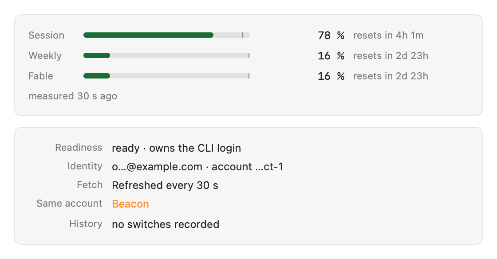
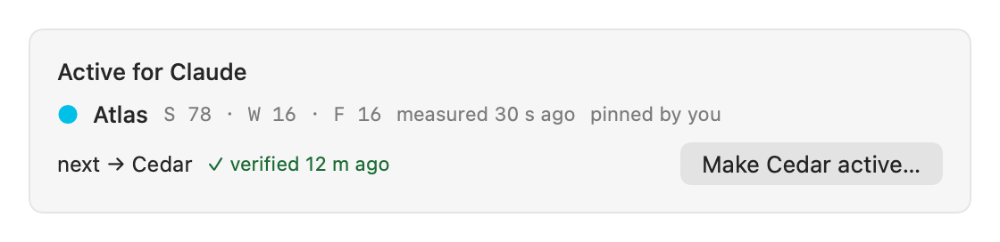

### The Token usage window

**⇄ › Token usage…** opens a window built from the CLIs' own local logs: tokens per day by provider, model, account, project, main-vs-subagent, and originator; cache-hit share; an API list-price equivalent (an estimate, never a bill); the rate-limit stops overlaid on the chart; ownership spans (which account held the login when); and a CSV export with provenance on every row.

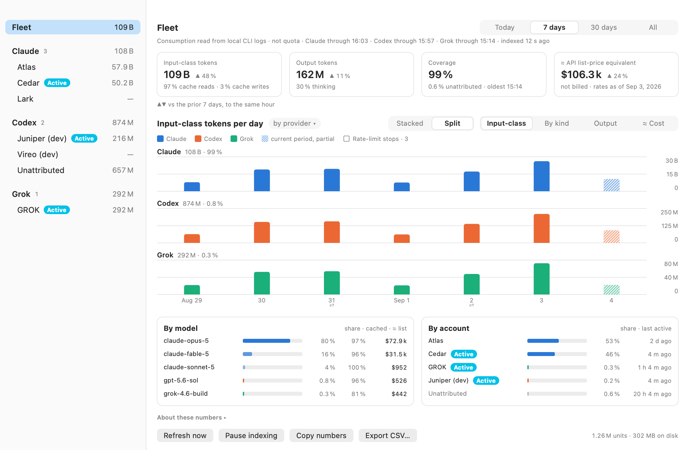

This is **consumption, not quota**: the numbers come from `~/.claude/projects/**/*.jsonl`, `~/.codex/sessions/**` (and any isolated Codex homes) and `~/.grok/`, indexed incrementally into a local SQLite ledger at `~/Library/Application Support/Claude Usage/telemetry/ledger.sqlite`. They will not reproduce the providers' quota bars; the window says so. Indexing runs off the main thread in bounded slices and can be paused from the window's footer. Raw events older than 90 days are folded into per-minute rows, losslessly for everything the window shows.

## Auto-switch

When any window of the active account crosses its threshold — **95 %** for the 5-hour session window, **99 %** for the weekly and the Fable weekly windows, configurable in **Settings › Active & Auto-switch** — the app switches the CLI to the best same-provider candidate: soonest weekly reset first, re-measured live right before the switch so a stale cache can never land you on an exhausted account. Switching before 100 % deliberately forfeits the last few percent so a running CLI session never stalls on "you've hit your limit". As usage climbs (25 / 50 / 75 / 90 % milestones) the predicted next candidate's stored login is validated in the background; a dead login gets you a notification while there is still time to repair it.

When the active account's usage endpoint refuses (per-IP 429 bursts are common with many accounts), the app reads the live counters from the rate-limit headers of a Messages API request instead, so the switch decision never goes blind. Duplicates of one account (two profiles holding the same login) are detected and never switched between.

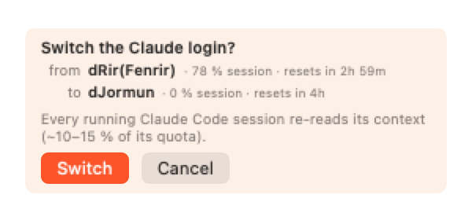

## Codex accounts

Codex accounts read their 5-hour and weekly windows from the ChatGPT backend, and the app shows how many **usage-limit resets** an account has, their expiry on demand, and a **Use one usage limit reset…** action that is only ever offered while the account is measured at its limit (a reset is a scarce grant; spending one is confirmed with the evidence on screen and never automatic).

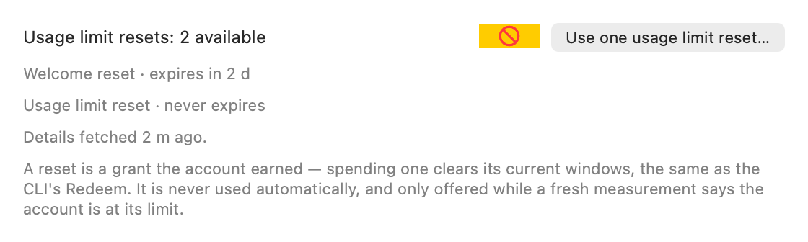

### Adding more than one Codex account

**Never run `codex login` or `codex logout` in the default `~/.codex` once an account is stored there.** `codex login` revokes, server-side, whatever credentials already sit in the home it runs in *before* it opens the browser (`codex-rs/cli/src/login.rs`: `login_with_chatgpt` → `clear_existing_auth_before_login` → `logout_with_revoke`). The account the widget applied there dies with it.

The CLI honours `$CODEX_HOME`, so every extra account gets its own home, where there is nothing to revoke:

**From the widget.** Open the account in **Settings › Accounts › Login** and click **Log in a new Codex account…**. The widget runs the CLI's login with `CODEX_HOME` pointed at a folder of its own under `~/.codex-accounts`, and imports the finished login. The default flow is **device code** (`codex login --device-auth`), which opens no browser: the sheet shows a link and a one-time code, each with a Copy button, so you finish the login in whichever browser or private window is signed in to the account you are adding. Cancel leaves every account untouched.

**From a terminal.**

```bash
mkdir -p ~/.codex-accounts/work
CODEX_HOME=~/.codex-accounts/work codex login
```

Then **Settings › Accounts › Login › Import from another Codex home…** and pick that folder. The sheet shows the account's email and the tail of its account id before you commit, and refuses an account another profile already holds.

How the pieces fit: the widget is the **single writer** of `~/.codex/auth.json`; activating a profile writes that profile's stored login there, which is how the CLI follows your switches. Import never touches `~/.codex`. Run `codex` itself against the default home — the isolated home exists for `codex login` only. The client-side mechanism is documented in [`docs/research/2026-09-03-codex-accounts-tokens.md`](docs/research/2026-09-03-codex-accounts-tokens.md).

## Privacy guarantees

The app contacts **only**: `claude.ai`, `api.anthropic.com`, `console.anthropic.com`, `status.claude.com`; for Codex — `chatgpt.com` (usage and reset credits) and `auth.openai.com` (token refresh); for Grok — `cli-chat-proxy.grok.com` and `auth.x.ai`. No telemetry, no update phone-home, no analytics, no crash reporting.

Credentials (session keys, OAuth tokens) live **only in the macOS Keychain**. They are never written to UserDefaults and never sent anywhere except the provider endpoints above. The one deliberate exception: activating a profile writes that profile's credentials to `~/.claude/.credentials.json` / the shared Claude Code Keychain item / `~/.codex/auth.json` (and a rotated Grok refresh token back to `~/.grok/auth.json`) — that is how the CLIs are switched, and it mirrors what the CLIs themselves store.

The token-usage ledger is a local SQLite file (`0700` directory, `0600` files) built from logs already on your disk; nothing from it leaves the machine.

## Requirements

- macOS 14 (Sonoma) or later
- Xcode 16+ (full Xcode) to build
- At least one of: a Claude subscription (claude.ai session or Claude Code login), an OpenAI Codex CLI login, a Grok CLI login

## Build & install

```bash
git clone https://github.com/FernandoTN/ClaudeUsageWidget.git
cd ClaudeUsageWidget
DEVELOPER_DIR=/Applications/Xcode.app/Contents/Developer xcodebuild \
  -project "Claude Usage.xcodeproj" -scheme "Claude Usage" \
  -configuration Release -derivedDataPath /tmp/cuw_build \
  -destination 'platform=macOS' build
cp -R "/tmp/cuw_build/Build/Products/Release/Claude Usage.app" /Applications/
open "/Applications/Claude Usage.app"
```

Or open `Claude Usage.xcodeproj` in Xcode and run. The project is **ad-hoc signed** (`CODE_SIGN_IDENTITY = "-"`) with no development team, so it builds from a clean clone with no signing setup; see [Troubleshooting](#troubleshooting) for what that means for the Keychain.

## First run

1. The setup wizard opens. If you are logged into the Claude Code CLI it detects that login and imports it; otherwise sign in to claude.ai through the in-app sheet and pick your organization.
2. Add more Claude accounts from **Settings › Accounts › + Add account…**: log the CLI into the other account (`/login`) and use that account's **Login › Sync**, or capture another claude.ai session.
3. If `~/.codex/auth.json` exists, the app imports it once as a Codex profile; add further Codex accounts as described above.
4. Pick a layout in **Settings › Display**. The default is **Active + dots** with the dashboard on click.

## Troubleshooting

**Keychain prompts after rebuilding.** Ad-hoc signatures change on every build and Keychain ACLs identify apps by signature. The app attaches permissive ACLs to its own items and repairs them on launch; if a prompt repeats after replacing the app, click "Always Allow" once.

**"login expired. Please run /login" in Claude Code.** The account that owns the CLI login has a dead token. Run `/login` in Claude Code, then **Accounts › that account › Login › Sync**.

**A Codex account stuck at 401 / "refresh token was revoked".** A `codex login` ran in the default `~/.codex` and revoked it. Do not repeat that; log the account in under its own home and import it (above). The dead-login flag clears itself on the next successful login, or from **Advanced › Dead-login flags**.

**Usage looks frozen.** Read the app's log (it logs under its bundle id):

```bash
/usr/bin/log show --predicate 'subsystem == "com.claudeusagewidget.app"' --info --last 10m
```

**Preferences show blank / everything looks default.** macOS `cfprefsd` can wedge (it logs `rejecting write … Path not accessible`); the app keeps a last-known-good copy and shows a banner. `killall cfprefsd` and relaunching the app clears it. `CLAUDE.md` has the full account.

**Claude usage endpoint 429s.** The usage endpoint sustains only a couple of requests per 30 s per IP; with many accounts the app round-robins background fetches and falls back to header readings for the active account. This is by design.

## Testing

```bash
DEVELOPER_DIR=/Applications/Xcode.app/Contents/Developer xcodebuild test \
  -project "Claude Usage.xcodeproj" -scheme "Claude Usage" -destination 'platform=macOS'
```

Tests are hosted in the app, so the suite briefly launches a menu-bar instance. Every surface also has a **frame harness**: set `TEST_RUNNER_CUW_RENDER_FRAMES=<dir>` and run the `FrameRenderTests`, `DesignFrameHarnessTests` and `TelemetryWindowTests` classes to render every state of the bar, dashboard, Settings pages and Token usage window as `@2x` PNGs from synthetic fixtures — the images in this README were produced that way.

## Architecture

```
Claude Usage/
├── App/                    App lifecycle, setup wizard trigger, telemetry start hook
├── MenuBar/
│   ├── MenuBarManager      Sweeps, auto-switch, preflight, header rescue, incidents
│   ├── StatusBarUIManager  Provider status items, in-place repaint, saved positions
│   ├── MenuBarSummaryRenderer / FleetSummary   Active + dots / counts layouts
│   ├── DashboardModel / DashboardView          The fleet dashboard and Insights
│   └── PopoverContentView  The classic per-account popover
├── Views/Settings/         Accounts inspector, Active & Auto-switch, Alerts, Display, Advanced
├── Telemetry/              Log readers, incremental indexer, SQLite ledger, report model,
│                           the Token usage window and its chart
└── Shared/
    ├── Services/           ClaudeAPIService, ClaudeCodeSyncService, CodexUsageService,
    │                       CodexLoginService, CodexResetCredits, GrokUsageService,
    │                       KeychainService, ProfileManager, NotificationManager
    ├── Storage/            ProfileStore (profiles + last-known-good preference cache)
    ├── Models/             Profile, ClaudeUsage, FleetInsights, ProviderActiveSelection …
    └── Utilities/          Constants, validators, formatters, Retry-After parsing
```

`CLAUDE.md` documents the load-bearing invariants (Keychain threading, token rotation, the focus-versus-active model, cfprefsd degradation) — read it before changing credential or menu-bar code. Design and status documents live under `docs/specs/`.

## Acknowledgments

A fork of [Claude Usage Tracker](https://github.com/hamed-elfayome/Claude-Usage-Tracker) by Hamed Elfayome (MIT). The original provided the multi-profile architecture, usage fetching and menu-bar rendering this app builds on; this fork removed its telemetry/update/feedback networking and added multi-provider active-account tracking, OAuth self-healing, auto-switch, the fleet bar and dashboard, and the token-usage ledger.

## License

[MIT](LICENSE)
